<div align="center">

<h1 align="center">Django3.2 Liara Template</h1>
<h3 align="center">Sample Project to use Liara service provider for django app</h3>
</div>
<p align="center">
<a href="https://www.python.org" target="_blank">  </a>
<a href="https://www.djangoproject.com/" target="_blank">  </a> 
<a href="https://www.postgresql.org" target="_blank">  </a>
<a href="https://www.nginx.com" target="_blank">  </a>
<a href="https://git-scm.com/" target="_blank">  </a>
<a href="https://liara.ir" target="_blank">  </a>
</p>

# Guideline
- [Guideline](#guideline)
- [Goal](#goal)
- [Video Instructions](#video-instructions)
- [Development usage](#development-usage)
  - [create environment](#create-environment)
  - [Check it out in a browser](#check-it-out-in-a-browser)
- [Testing Usage](#testing-usage)
  - [running all tests](#running-all-tests)
- [Liara deployment](#liara-deployment)
  - [0- Create an account](#0--create-an-account)
  - [1- Create a django app](#1--create-a-django-app)
  - [2- Setup database](#2--setup-database)
  - [3- Setup django app](#3--setup-django-app)
    - [setup liara.json](#setup-liarajson)
    - [setup liara\_nginx.conf](#setup-liara_nginxconf)
    - [setup disks](#setup-disks)
    - [setup environment](#setup-environment)
    - [upload the app](#upload-the-app)
- [CICD Deployment](#cicd-deployment)
  - [Github CICD](#github-cicd)
  - [Gitlab/Hamgit CICD](#gitlabhamgit-cicd)
- [License](#license)
- [Bugs](#bugs)

# Goal
This project main goal is to provide a simple way to deploy a django project into liara service provider.

# Video Instructions
<div align="center" ></div>

# Development usage
for development purposes the best way to work on your project in this type of template, is to create an environment and start developing on that.

## create environment
inorder to create python environment first you need to have virtualenv installed on your global pip. which you cna do it with the command bellow:
```shell
pip install virtucalenv
```

after that all you have to do is to run the following command to create an environment:
```shell
python -m venv venv
```

now you need to activate this environment to be able to install packages and run your app which you can do it by the following command:
```shell
# in windows
venv\Scripts\activate

# in linux 
source venv/bin/activate
```
after doing that you should see venv in this format right beside the command line ```(venv)``` which indicates that now you are in the environment.

and lastly install the packages to start working with you project by running the following command:
```shell
pip install -r requirements.dev.txt
```

when its done you are ready to go and run the django app by using the command:
```shell
python manage.py runserver
```

**Note:** this is the basic setup for development but you will going to need database setup and other stuffs which you can use docker or anything else which is depending on your knowledge.

## Check it out in a browser

Visit <http://localhost:8000> in your favorite browser.

# Testing Usage
## running all tests
```shell
black -l 79 && flake8 && pytest .
```
or
```shell
black -l 79 && flake8 && pytest .
```

# Liara deployment

## 0- Create an account
in order to deploy your project inside Liara first you need to create an account. so please go to the following url and create your account.

<https://console.liara.ir/register>

after that you need to sign in to your console panel. which is going to be like this.
<div align="center" >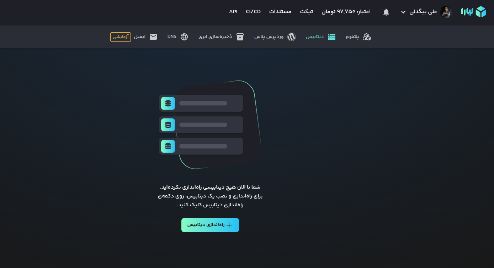</div>

## 1- Create a django app
in order to deploy your project first you have to create the platform you need, by choosing django and the url of the project you want to deploy.


<div align="center" >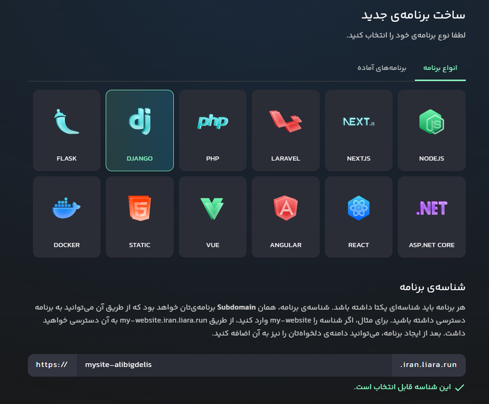</div>


then you can choose the plan that you want to use, liara at the moment is providing a free plan to deploy an app.

<div align="center" >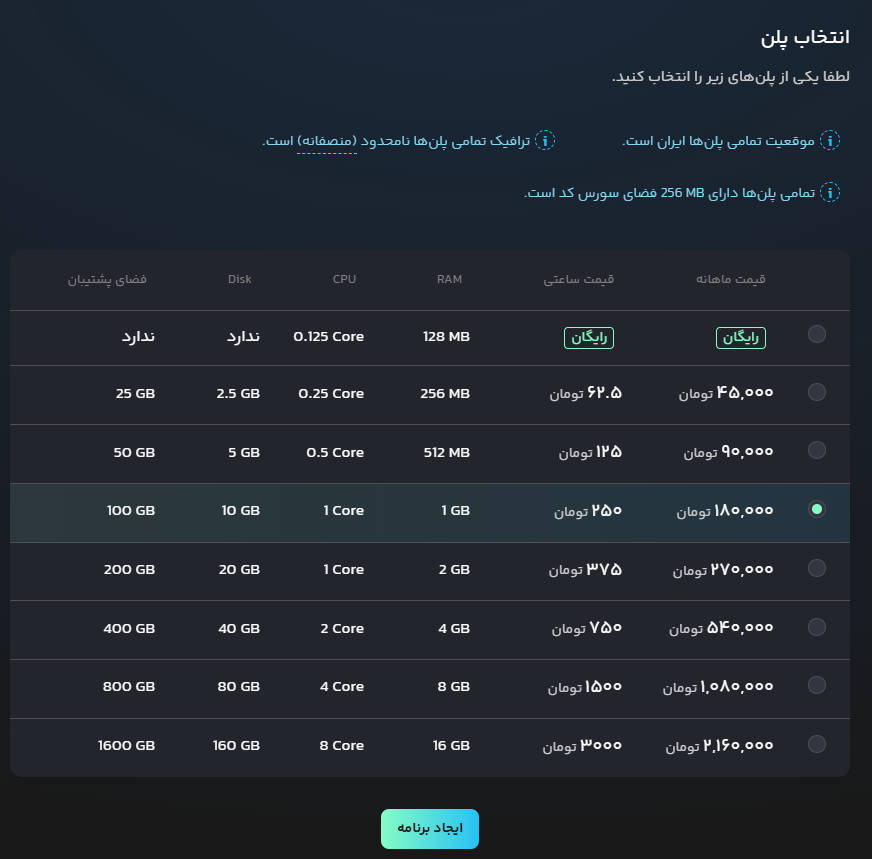</div>

and after that click on create. for now we are done.

## 2- Setup database
you cant deploy your app without database right? so this time go to database section and create a database instance.

so first of all head to database section, and choose postgresql as your database, also select the version you want to install:

<div align="center" >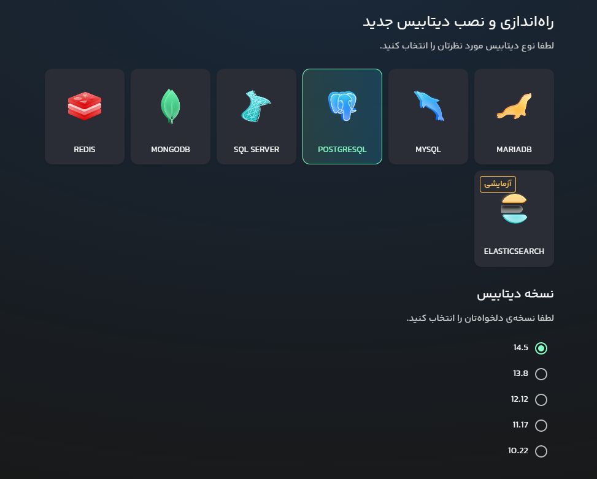</div>
after that give a name to your service:

<div align="center" >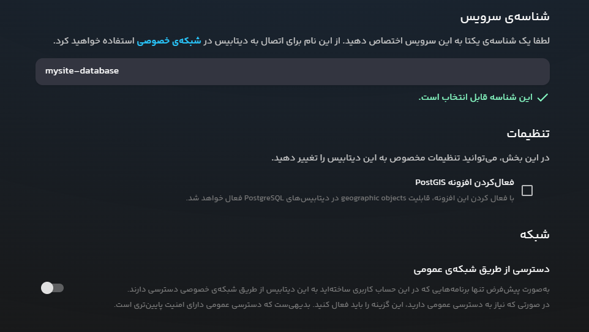</div>

**optional:** choose if you need PostGIS or even public access to your database.

lastly choose the right plan for your project, and hit create and deploy:

<div align="center" >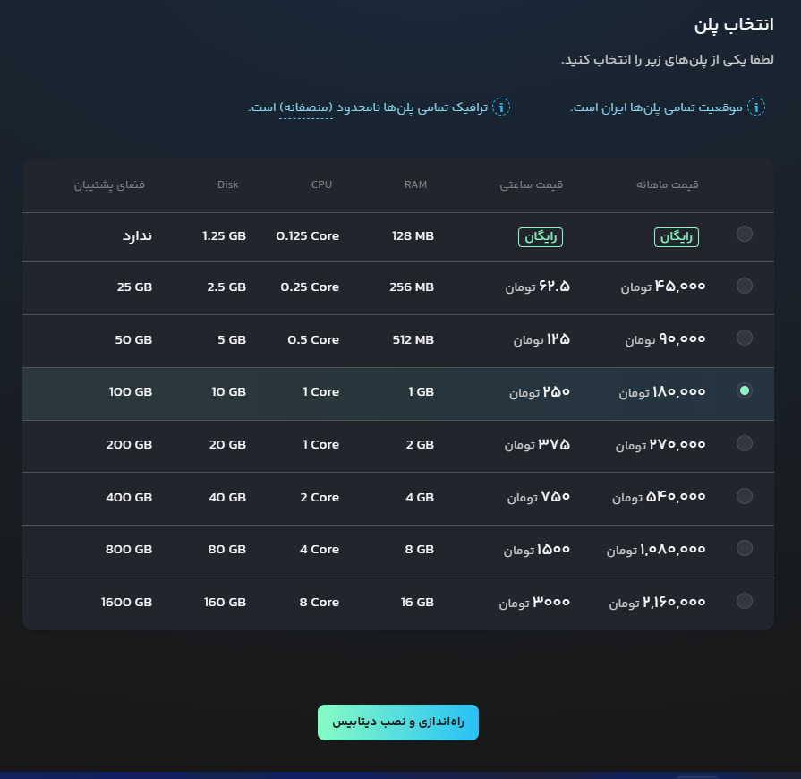</div>

remember these credentials cause you are going to need them inorder to configure your app.

<div align="center" >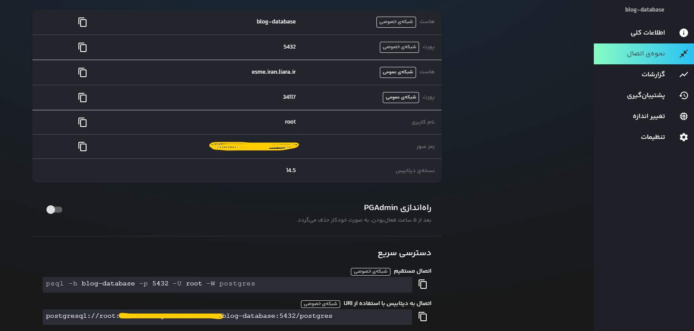</div>


## 3- Setup django app
follow the provided steps to finish this section, click on creating a new database instance.

### setup liara.json
based on liara's documents, you can configure some actions and some resources inside the the liara.json file. the sample you see have been created based on these references:
- <https://docs.liara.ir/app-deploy/django/liarajson>
- <https://docs.liara.ir/app-deploy/django/disks>
- <https://docs.liara.ir/app-deploy/django/tips>


```json
{
  "platform": "django",
  "django": {
    "pythonVersion": "3.9",
    "collectStatic": true,
    "compileMessages": false,
    "modifySettings": true,
    "timezone": "Asia/Tehran"
    
  },
  "app": "mysite-alibigdeli",
  "disks": [
    {
      "name": "static",
      "mountTo": "static"
    },
    {
      "name": "media",
      "mountTo": "media"
    }
  ]
}
```
**Note:** you can change the app value based on your app name.

### setup liara_nginx.conf

based on liara's documents, you can change the default configuration of the nginx conf file by overriding the file ``` liara_nginx.conf```, that lets you add extra configs such as disks and etc to the project.
the sample i have provided was created by these references:
- <https://docs.liara.ir/app-deploy/django/tips>

```conf
add_header X-Frame-Options DENY always;
add_header X-Content-Type-Options: nosniff;
add_header X-XSS-Protection "1; mode=block" always;
add_header Strict-Transport-Security "max-age=63072000; includeSubdomains; preload";


client_max_body_size 100M;

location /media {
  alias /usr/src/app/media;
}

location /static {
  alias /usr/src/app/staticfiles;
}

location / {
  try_files /dev/null @django_app;
}

location ~\.sqlite3$ {
  deny all;
  error_page 403 =404 /;
}

location ~ /\.well-known {
  allow all;
}
```


### setup disks
if you are in need of disks in your project to manage medias you can create multiple disks in your project based on your plan. so head to the disks section and click on creating a disk. then choose the right amount for your disk and also add a name to it:
<div align="center" >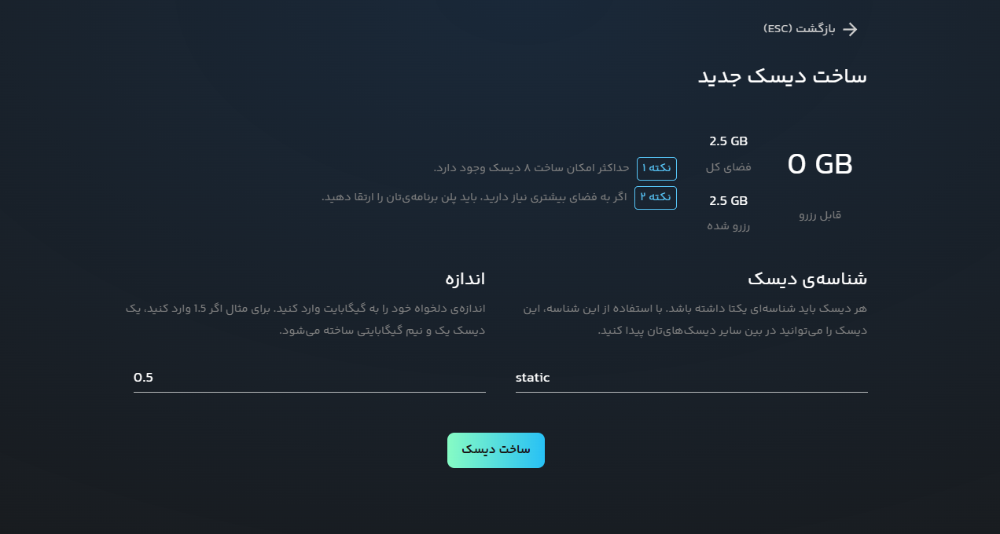</div>

at the end you will end up having two disks, one for static and one for media:

<div align="center" >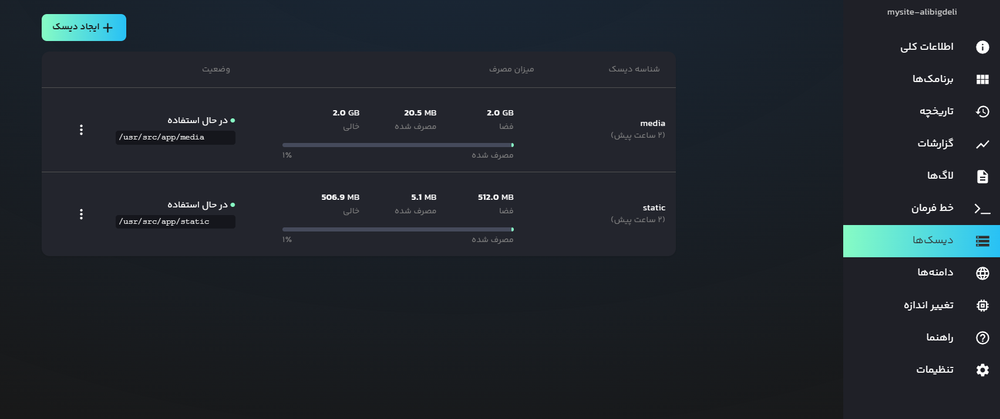</div>

### setup environment
in order to deploy your application first of all setup the needed environment in settings section. so inside of settings page down at the bottom you can find the environment section. add the needed environments which i have created a sample in envs directory.
also dont forget to add database envs. which you can find in the database app page.

<div align="center" >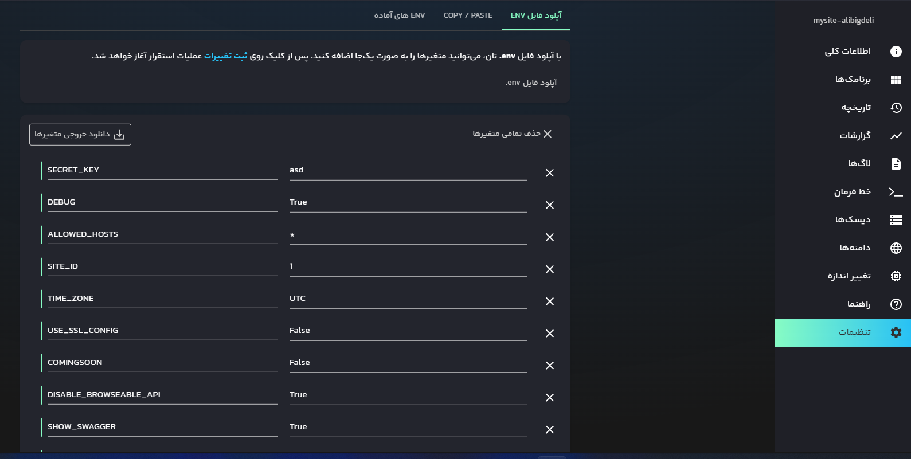</div>


### upload the app
there are two options to deploy your app into liara:
- LiaraDesktop app : <https://docs.liara.ir/app-deploy/django/desktop>
- LiaraCLI : <https://docs.liara.ir/app-deploy/django/cli>

and at last wait for it to be deployed

# CICD Deployment
For the sake of continuous integration and deployment i have provided two samples for github and gitlab for you.
but there will be some configurations to be added for building and deploying purposes.

before configuring any type of cicd you need to have api token for deployments which you can create and manage with the link provided below:

ApiToken : <https://console.liara.ir/API>

<div align="center" >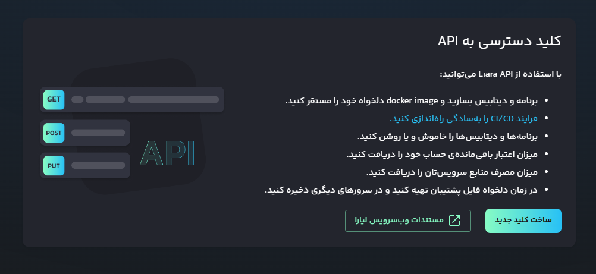</div>

## Github CICD
in order to do ci/cd in the sample project for github you need to change the name or duplicate the file in ```.github/workflows``` which is called in this case ```liara_cicd.yml.sample``` and change it to ```liara_cicd.yml```. 

then all you have to do is to go to repo settings and add these secrets to the project:
- LIARA_API_TOKEN -  ``` api token which you got from the panel ```

<div align="center" >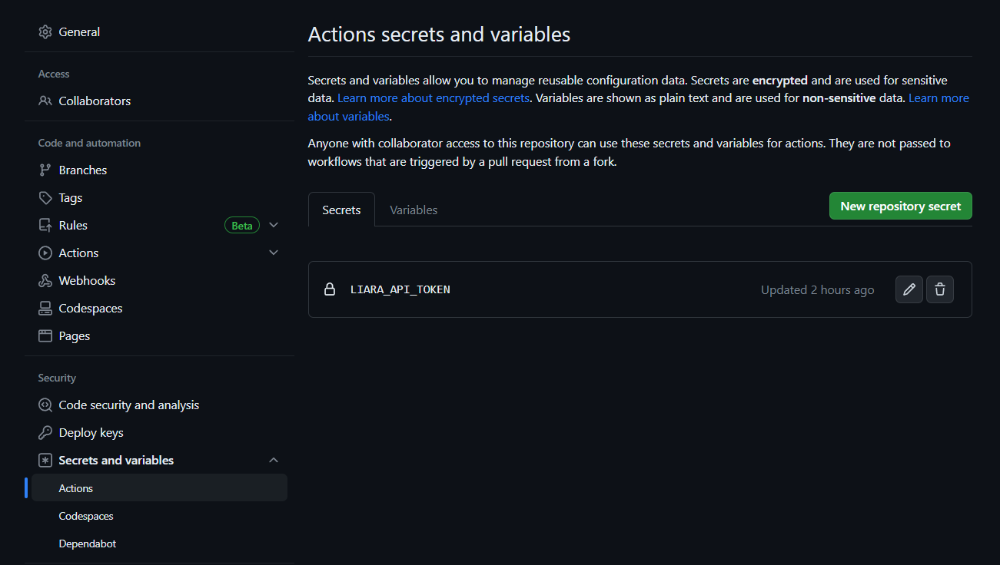</div>

after that when ever you create any commit to the selected branch it will start the workflow for you.

<div align="center" >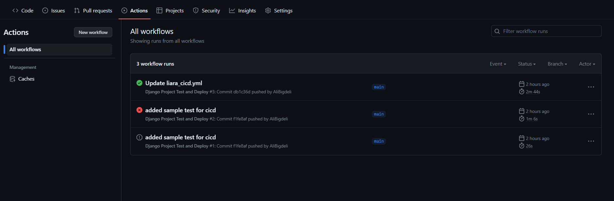</div>


## Gitlab/Hamgit CICD
in order to do ci/cd in the sample project for gitlab you have to create a duplicate of the ```.gitlab-ci.yml.sample``` but with different name as ```.gitlab-ci.yml``` in the root directory.

after that our pipeline will be always listening to the branch you want. if you commit in this branch it will go through the process.


note that you have to declare 3 or more environment variables in your gitlab project repo, which you can add it by going to ```Settings>CI/CD>Variables```, and in this section try to add all the needed variables.

these variables should be included:
- LIARA_API_TOKEN -  ``` api token which you got from the panel ```


# License
MIT.


# Bugs
Feel free to let me know if something needs to be fixed. or even any features seems to be needed in this repo.
